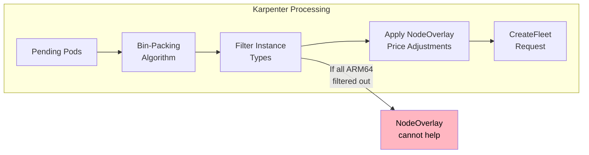
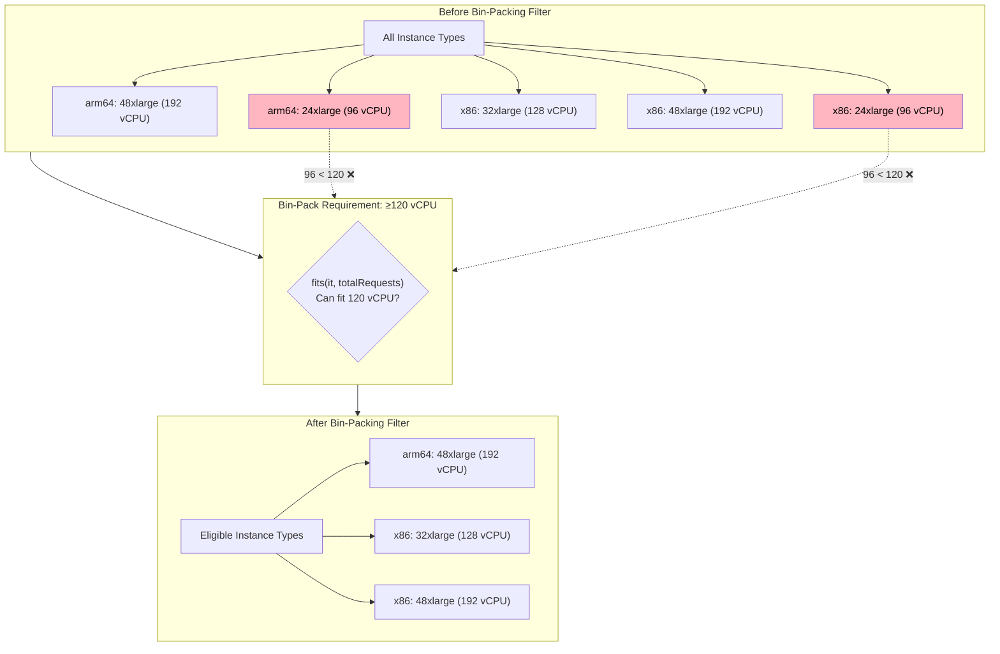
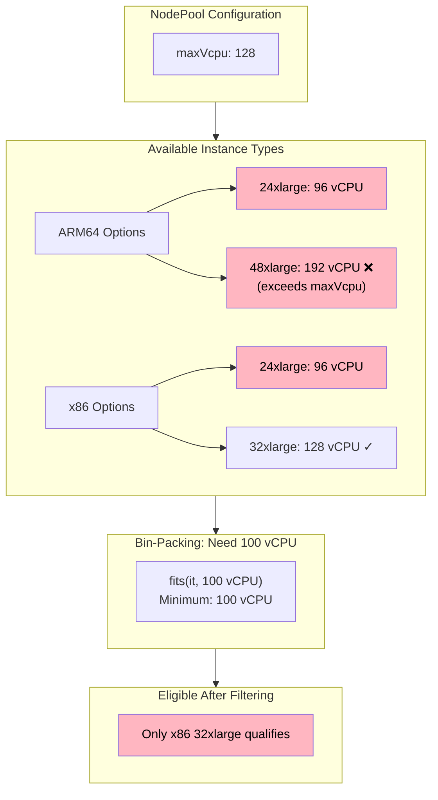
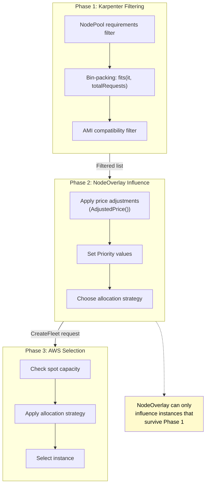

# Karpenter Bin-Packing: How It Affects NodeOverlay Effectiveness

This document explains how Karpenter's bin-packing algorithm can affect—and sometimes bypass—NodeOverlay price adjustments, leading to unexpected instance selection behavior.

## Table of Contents

- [Overview](#overview)
- [The Bin-Packing Algorithm](#the-bin-packing-algorithm)
- [How Bin-Packing Filters Instance Types](#how-bin-packing-filters-instance-types)
- [The ARM64 Size Gap Problem](#the-arm64-size-gap-problem)
- [When NodeOverlay Cannot Help](#when-nodeoverlay-cannot-help)
- [Diagnosing the Issue](#diagnosing-the-issue)
- [Solutions and Workarounds](#solutions-and-workarounds)
- [Code References](#code-references)

---

## Overview

Veneer's NodeOverlay feature influences instance selection by adjusting prices, which become Priority values in AWS CreateFleet requests. However, this influence only works when multiple instance types are eligible candidates.

**The key insight**: Karpenter's bin-packing algorithm filters instance types *before* NodeOverlay can influence selection. If bin-packing eliminates all instances of a particular architecture, NodeOverlay has nothing to prefer.



---

## The Bin-Packing Algorithm

Karpenter uses a **First-Fit Decreasing (FFD)** bin-packing algorithm to minimize the number of nodes needed for pending pods.

### How It Works

1. **Sort pods by resource requirements** (largest first)
2. **For each pod**, try to fit it into an existing "virtual node"
3. **If no existing node can fit the pod**, create a new virtual node
4. **Select the smallest instance type** that can satisfy each virtual node's aggregate requirements

### Code: Pod Sorting

Pods are sorted by CPU and memory in descending order before scheduling begins. This is the first step of the FFD algorithm.

From [`queue.go:37-43`](https://github.com/kubernetes-sigs/karpenter/blob/v1.1.0/pkg/controllers/provisioning/scheduling/queue.go#L37-L43):

```go
// NewQueue constructs a new queue given the input pods, sorting them to optimize for bin-packing into nodes.
func NewQueue(pods []*v1.Pod, podData map[types.UID]*PodData) *Queue {
    sort.Slice(pods, byCPUAndMemoryDescending(pods, podData))
    return &Queue{
        pods:    pods,
        lastLen: map[types.UID]int{},
    }
}
```

The sorting function prioritizes CPU, then memory. From [`queue.go:72-108`](https://github.com/kubernetes-sigs/karpenter/blob/v1.1.0/pkg/controllers/provisioning/scheduling/queue.go#L72-L108):

```go
func byCPUAndMemoryDescending(pods []*v1.Pod, podData map[types.UID]*PodData) func(i int, j int) bool {
    return func(i, j int) bool {
        lhs := podData[lhsPod.UID].Requests
        rhs := podData[rhsPod.UID].Requests

        cpuCmp := resources.Cmp(lhs[v1.ResourceCPU], rhs[v1.ResourceCPU])
        if cpuCmp < 0 {
            // LHS has less CPU, so it should be sorted after
            return false
        } else if cpuCmp > 0 {
            return true
        }
        // ... memory comparison follows
    }
}
```

### Code: Scheduling Loop

The main scheduling loop in [`scheduler.go:381-436`](https://github.com/kubernetes-sigs/karpenter/blob/v1.1.0/pkg/controllers/provisioning/scheduling/scheduler.go#L381-L436) processes pods in order:

```go
func (s *Scheduler) Solve(ctx context.Context, pods []*corev1.Pod) (Results, error) {
    // ...
    q := NewQueue(pods, s.cachedPodData)

    for {
        pod, ok := q.Pop()
        if !ok {
            break
        }
        if err := s.trySchedule(ctx, pod.DeepCopy()); err != nil {
            // ... handle error, relax preferences, retry
        }
    }
    // ...
}
```

### Code: Adding Pods to NodeClaims

When adding a pod, Karpenter tries existing nodes first, then in-flight NodeClaims, then creates new ones. From [`scheduler.go:493-518`](https://github.com/kubernetes-sigs/karpenter/blob/v1.1.0/pkg/controllers/provisioning/scheduling/scheduler.go#L493-L518):

```go
func (s *Scheduler) add(ctx context.Context, pod *corev1.Pod) error {
    // first try to schedule against an in-flight real node
    if err := s.addToExistingNode(ctx, pod); err == nil {
        return nil
    }
    // Sort NodeClaims by number of pods (fewer pods = more room)
    sort.Slice(s.newNodeClaims, func(a, b int) bool {
        return len(s.newNodeClaims[a].Pods) < len(s.newNodeClaims[b].Pods)
    })

    // Pick existing node that we are about to create
    if err := s.addToInflightNode(ctx, pod); err == nil {
        return nil
    }
    // Create a new NodeClaim
    return s.addToNewNodeClaim(ctx, pod)
}
```

### Example: Bin-Packing in Action

Consider 10 pending pods, each requesting 12 vCPUs:

```
Total CPU needed: 10 pods × 12 vCPU = 120 vCPU
```

Karpenter's options:
- **Option A**: 2 nodes × 64 vCPU = 128 vCPU capacity (8 vCPU wasted)
- **Option B**: 1 node × 128 vCPU = 128 vCPU capacity (8 vCPU wasted)

The algorithm prefers **Option B** because it minimizes node count, even though the total capacity is the same.

---

## How Bin-Packing Filters Instance Types

When Karpenter determines that a single node with 120+ vCPU is optimal, it filters the instance type list to only include types that can satisfy this requirement.

### Code: Instance Type Filtering

The filtering happens in [`nodeclaim.go:383-451`](https://github.com/kubernetes-sigs/karpenter/blob/v1.1.0/pkg/controllers/provisioning/scheduling/nodeclaim.go#L383-L451):

```go
func filterInstanceTypesByRequirements(
    instanceTypes []*cloudprovider.InstanceType,
    requirements scheduling.Requirements,
    podRequests, daemonRequests, totalRequests corev1.ResourceList,
    relaxMinValues bool,
) (cloudprovider.InstanceTypes, map[string]int, error) {
    remaining := cloudprovider.InstanceTypes{}

    for _, it := range instanceTypes {
        itCompat := compatible(it, requirements)
        itFits := fits(it, totalRequests)  // <-- This checks if instance can fit total resources
        itHasOffering := false
        for _, of := range it.Offerings {
            if of.Available && requirements.IsCompatible(of.Requirements, ...) {
                itHasOffering = true
                break
            }
        }

        // Only keep instance types that meet ALL criteria
        if itCompat && itFits && itHasOffering {
            remaining = append(remaining, it)
        }
    }
    // ...
}
```

The `fits()` function at [`nodeclaim.go:457-459`](https://github.com/kubernetes-sigs/karpenter/blob/v1.1.0/pkg/controllers/provisioning/scheduling/nodeclaim.go#L457-L459) checks if an instance type can accommodate the total resource requests:

```go
func fits(instanceType *cloudprovider.InstanceType, requests corev1.ResourceList) bool {
    return resources.Fits(requests, instanceType.Allocatable())
}
```

### Code: CanAdd Method

When a pod is added to a NodeClaim, the aggregate resources are recalculated and instance types are re-filtered. From [`nodeclaim.go:112-173`](https://github.com/kubernetes-sigs/karpenter/blob/v1.1.0/pkg/controllers/provisioning/scheduling/nodeclaim.go#L112-L173):

```go
func (n *NodeClaim) CanAdd(ctx context.Context, pod *corev1.Pod, podData *PodData, relaxMinValues bool) (...) {
    // ...
    // Merge existing requests with new pod's requests
    requests := resources.Merge(n.Spec.Resources.Requests, podData.Requests)

    // Filter instance types that can fit the TOTAL requests
    remaining, unsatisfiableKeys, err := filterInstanceTypesByRequirements(
        n.InstanceTypeOptions,
        nodeClaimRequirements,
        podData.Requests,
        n.daemonResources,
        requests,  // <-- Total aggregate requests
        relaxMinValues,
    )
    // ...
}
```

### Visualization



In this example, both architectures still have eligible instances (48xlarge), so NodeOverlay can influence the selection.

---

## The ARM64 Size Gap Problem

AWS Graviton (ARM64) instances have a size gap that x86 instances don't have:

| Size | ARM64 (Graviton) | x86 (Intel/AMD) |
|------|------------------|-----------------|
| 24xlarge | 96 vCPU | 96 vCPU |
| 32xlarge | **Does not exist** | 128 vCPU |
| 48xlarge | 192 vCPU | 192 vCPU |

This gap creates a range (97-128 vCPU) where only x86 instances are available.

### The Problem Scenario

If your NodePool has `maxVcpu: 128` and bin-packing requires 100+ vCPU:



**Result**: ARM64 is completely filtered out. NodeOverlay's `-50%` price adjustment on ARM64 has no effect because there are no ARM64 candidates.

---

## When NodeOverlay Cannot Help

NodeOverlay adjusts the *priority* of instance types in the CreateFleet request. It cannot:

1. **Add instance types** that were filtered out by bin-packing
2. **Change NodePool requirements** (like maxVcpu)
3. **Override Karpenter's bin-packing decisions**

### Where NodeOverlay Takes Effect

NodeOverlay influences selection in the AWS provider when building the CreateFleet request. From [`instance.go:456-486`](https://github.com/aws/karpenter-provider-aws/blob/v1.1.0/pkg/providers/instance/instance.go#L456-L486) (approximate):

```go
func (p *DefaultProvider) getOverrides(...) []ec2types.FleetLaunchTemplateOverridesRequest {
    var overrides []ec2types.FleetLaunchTemplateOverridesRequest
    for _, offering := range offerings {
        overrides = append(overrides, ec2types.FleetLaunchTemplateOverridesRequest{
            InstanceType:     ec2types.InstanceType(instanceType.Name),
            // ...
            // CRITICAL: Priority is set to the offering price (adjusted by NodeOverlay)
            Priority: lo.ToPtr(float64(offering.Price)),
        })
    }
    return overrides
}
```

But this only affects instance types that **already passed** the bin-packing filter.

### The Decision Flow



---

## Diagnosing the Issue

### Symptom: x86 Selected Despite ARM64 Price Preference

If you've configured a NodeOverlay to prefer ARM64 but are still seeing x86 instances:

1. **Check the NodeClaim requirements**
   ```bash
   kubectl get nodeclaim <name> -o yaml | grep -A 50 requirements
   ```

   Look for the instance type list. If only x86 types are listed, bin-packing has already filtered out ARM64.

2. **Check CloudTrail CreateFleet requests**

   Look at the `LaunchTemplateConfigs` in the request:
   - **Two configs** (ARM64 AMI + x86 AMI) = NodeOverlay can influence
   - **One config** (x86 AMI only) = ARM64 was filtered out before NodeOverlay

3. **Check the aggregate CPU requirements**

   Sum up the CPU requests of pods that triggered the NodeClaim. If it exceeds the ARM64 size threshold (e.g., 96 vCPU for 24xlarge), that's likely the cause.

### Example: Identifying the Problem in NodeClaim

```bash
# Get the NodeClaim
kubectl get nodeclaim example-abc123 -o yaml
```

```yaml
spec:
  requirements:
    - key: node.kubernetes.io/instance-type
      operator: In
      values:
        - m7a.32xlarge    # 128 vCPU, x86 only
        - m7i.32xlarge    # 128 vCPU, x86 only
        - r7a.32xlarge    # 128 vCPU, x86 only
        # Notice: No ARM64 instances listed!
```

This NodeClaim has already been filtered to only include 32xlarge x86 instances.

### Example: CloudTrail Request Analysis

**With NodeOverlay working (both architectures present):**
```json
{
  "LaunchTemplateConfigs": [
    {
      "LaunchTemplateSpecification": { "LaunchTemplateName": "arm64-template" },
      "Overrides": [
        { "InstanceType": "m8g.24xlarge", "Priority": 0.635 }
      ]
    },
    {
      "LaunchTemplateSpecification": { "LaunchTemplateName": "x86-template" },
      "Overrides": [
        { "InstanceType": "m7i.24xlarge", "Priority": 0.78 }
      ]
    }
  ]
}
```

**Without ARM64 (bin-packing filtered it out):**
```json
{
  "LaunchTemplateConfigs": [
    {
      "LaunchTemplateSpecification": { "LaunchTemplateName": "x86-template" },
      "Overrides": [
        { "InstanceType": "m7i.32xlarge", "Priority": 0.95 }
      ]
    }
  ]
}
```

---

## Solutions and Workarounds

### Solution 1: Increase maxVcpu to Include Larger ARM64 Sizes

If your NodePool has `maxVcpu: 128`, increase it to `192` to allow Graviton 48xlarge:

```yaml
requirements:
  - key: karpenter.k8s.aws/instance-cpu
    operator: Lt
    values:
      - "193"  # Allows up to 192 vCPU (48xlarge)
```

**Trade-off**: Larger nodes mean more pods per node, which may affect blast radius during node failures.

### Solution 2: Reduce maxVcpu to Exclude x86-Only Sizes

Set `maxVcpu: 96` to prevent bin-packing from choosing 32xlarge:

```yaml
requirements:
  - key: karpenter.k8s.aws/instance-cpu
    operator: Lt
    values:
      - "97"  # Max 96 vCPU (24xlarge)
```

**Trade-off**: Karpenter may create more nodes to fit the same workload.

### Solution 3: Explicitly Exclude 32xlarge Sizes

```yaml
requirements:
  - key: karpenter.k8s.aws/instance-size
    operator: NotIn
    values:
      - 32xlarge
```

**Trade-off**: Same as Solution 2—more nodes may be created.

### Solution 4: Force Architecture in NodePool

If ARM64 is strongly preferred, constrain the NodePool:

```yaml
requirements:
  - key: kubernetes.io/arch
    operator: In
    values:
      - arm64
```

**Trade-off**: No x86 fallback if ARM64 spot capacity is unavailable.

---

## Code References

| Component | Repository | File | Line |
|-----------|------------|------|------|
| Pod sorting (FFD) | karpenter | [`queue.go`](https://github.com/kubernetes-sigs/karpenter/blob/v1.1.0/pkg/controllers/provisioning/scheduling/queue.go#L37-L43) | 37-43 |
| Sorting by CPU/memory | karpenter | [`queue.go`](https://github.com/kubernetes-sigs/karpenter/blob/v1.1.0/pkg/controllers/provisioning/scheduling/queue.go#L72-L108) | 72-108 |
| Main scheduling loop | karpenter | [`scheduler.go`](https://github.com/kubernetes-sigs/karpenter/blob/v1.1.0/pkg/controllers/provisioning/scheduling/scheduler.go#L381-L436) | 381-436 |
| Add pod to NodeClaim | karpenter | [`scheduler.go`](https://github.com/kubernetes-sigs/karpenter/blob/v1.1.0/pkg/controllers/provisioning/scheduling/scheduler.go#L493-L518) | 493-518 |
| Instance type filtering | karpenter | [`nodeclaim.go`](https://github.com/kubernetes-sigs/karpenter/blob/v1.1.0/pkg/controllers/provisioning/scheduling/nodeclaim.go#L383-L451) | 383-451 |
| fits() function | karpenter | [`nodeclaim.go`](https://github.com/kubernetes-sigs/karpenter/blob/v1.1.0/pkg/controllers/provisioning/scheduling/nodeclaim.go#L457-L459) | 457-459 |
| CanAdd method | karpenter | [`nodeclaim.go`](https://github.com/kubernetes-sigs/karpenter/blob/v1.1.0/pkg/controllers/provisioning/scheduling/nodeclaim.go#L112-L173) | 112-173 |
| Priority assignment | karpenter-provider-aws | [`instance.go`](https://github.com/aws/karpenter-provider-aws/blob/v1.1.0/pkg/providers/instance/instance.go#L456-L486) | 456-486 |
| Allocation strategy | karpenter-provider-aws | [`types.go`](https://github.com/aws/karpenter-provider-aws/blob/v1.1.0/pkg/providers/instance/types.go#L209-L217) | 209-217 |

---

## Summary

| Stage | What Happens | Code Location | Can NodeOverlay Influence? |
|-------|--------------|---------------|---------------------------|
| **Pod Sorting** | Sort by CPU/memory descending | `queue.go:37-43` | No |
| **NodePool Requirements** | Filter by CPU, memory, family, etc. | `scheduler.go:144-147` | No |
| **Bin-Packing** | `fits(it, totalRequests)` | `nodeclaim.go:457-459` | No |
| **AMI Mapping** | Group instance types by architecture | `resolver.go:145-196` | No |
| **Price Adjustment** | Apply NodeOverlay adjustments | `types.go:369-384` | **Yes** |
| **CreateFleet** | AWS selects from eligible instances | `instance.go:456-486` | **Yes** (via Priority) |

**Key Takeaways**:

1. NodeOverlay influences selection *among eligible candidates*, not the filtering process
2. The bin-packing `fits()` check happens before NodeOverlay can influence selection
3. The ARM64 size gap (no 32xlarge Graviton) can eliminate ARM64 from consideration
4. Check NodeClaim requirements and CloudTrail to diagnose unexpected selections
5. Adjust `maxVcpu` or exclude specific sizes to ensure ARM64 remains eligible
