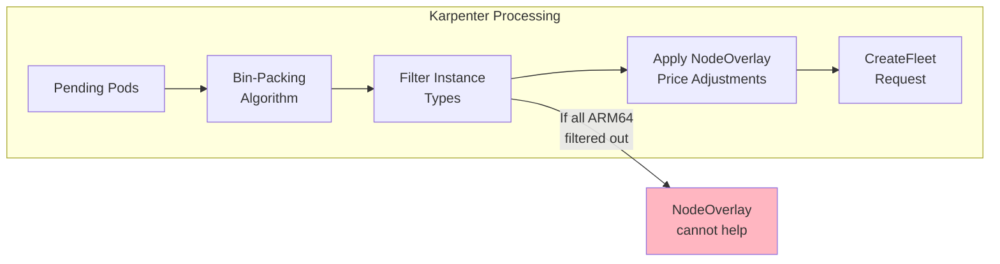
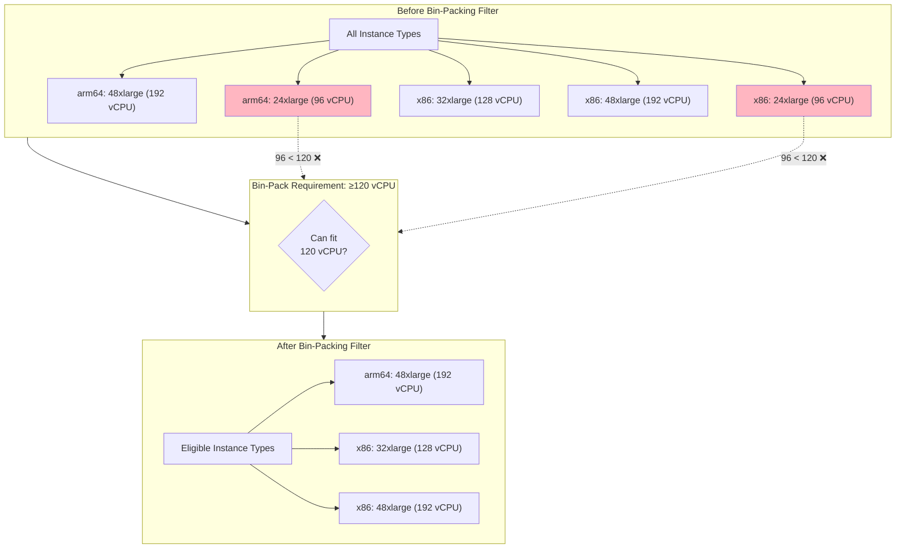
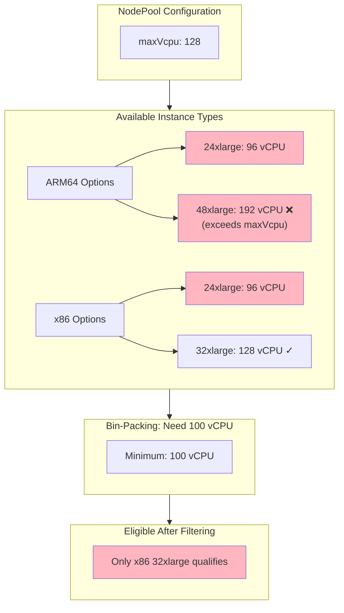
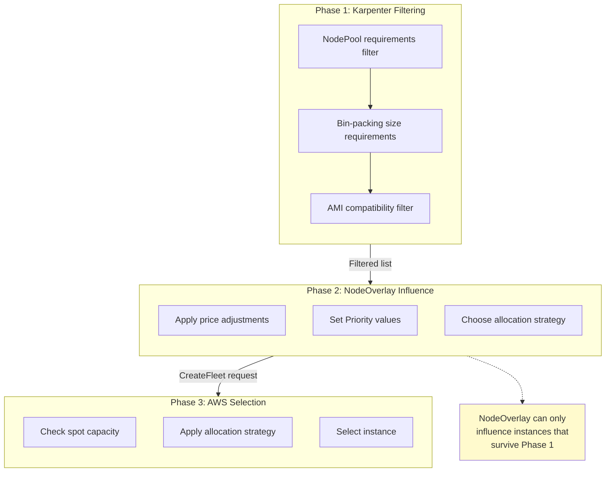

# Karpenter Bin-Packing: How It Affects NodeOverlay Effectiveness

This document explains how Karpenter's bin-packing algorithm can affect—and sometimes bypass—NodeOverlay price adjustments, leading to unexpected instance selection behavior.

## Table of Contents

- [Overview](#overview)
- [The Bin-Packing Algorithm](#the-bin-packing-algorithm)
- [How Bin-Packing Filters Instance Types](#how-bin-packing-filters-instance-types)
- [The ARM64 Size Gap Problem](#the-arm64-size-gap-problem)
- [When NodeOverlay Cannot Help](#when-nodeoverlay-cannot-help)
- [Diagnosing the Issue](#diagnosing-the-issue)
- [Solutions and Workarounds](#solutions-and-workarounds)

---

## Overview

Veneer's NodeOverlay feature influences instance selection by adjusting prices, which become Priority values in AWS CreateFleet requests. However, this influence only works when multiple instance types are eligible candidates.

**The key insight**: Karpenter's bin-packing algorithm filters instance types *before* NodeOverlay can influence selection. If bin-packing eliminates all instances of a particular architecture, NodeOverlay has nothing to prefer.



---

## The Bin-Packing Algorithm

Karpenter uses a **First-Fit Decreasing (FFD)** bin-packing algorithm to minimize the number of nodes needed for pending pods.

### How It Works

1. **Sort pods by resource requirements** (largest first)
2. **For each pod**, try to fit it into an existing "virtual node"
3. **If no existing node can fit the pod**, create a new virtual node
4. **Select the smallest instance type** that can satisfy each virtual node's aggregate requirements

### Example: Bin-Packing in Action

Consider 10 pending pods, each requesting 12 vCPUs:

```
Total CPU needed: 10 pods × 12 vCPU = 120 vCPU
```

Karpenter's options:
- **Option A**: 2 nodes × 64 vCPU = 128 vCPU capacity (8 vCPU wasted)
- **Option B**: 1 node × 128 vCPU = 128 vCPU capacity (8 vCPU wasted)

The algorithm prefers **Option B** because it minimizes node count, even though the total capacity is the same.

---

## How Bin-Packing Filters Instance Types

When Karpenter determines that a single node with 120+ vCPU is optimal, it filters the instance type list to only include types that can satisfy this requirement.



In this example, both architectures still have eligible instances (48xlarge), so NodeOverlay can influence the selection.

---

## The ARM64 Size Gap Problem

AWS Graviton (ARM64) instances have a size gap that x86 instances don't have:

| Size | ARM64 (Graviton) | x86 (Intel/AMD) |
|------|------------------|-----------------|
| 24xlarge | 96 vCPU | 96 vCPU |
| 32xlarge | **Does not exist** | 128 vCPU |
| 48xlarge | 192 vCPU | 192 vCPU |

This gap creates a range (97-128 vCPU) where only x86 instances are available.

### The Problem Scenario

If your NodePool has `maxVcpu: 128` and bin-packing requires 100+ vCPU:



**Result**: ARM64 is completely filtered out. NodeOverlay's `-50%` price adjustment on ARM64 has no effect because there are no ARM64 candidates.

---

## When NodeOverlay Cannot Help

NodeOverlay adjusts the *priority* of instance types in the CreateFleet request. It cannot:

1. **Add instance types** that were filtered out by bin-packing
2. **Change NodePool requirements** (like maxVcpu)
3. **Override Karpenter's bin-packing decisions**

### The Decision Flow



---

## Diagnosing the Issue

### Symptom: x86 Selected Despite ARM64 Price Preference

If you've configured a NodeOverlay to prefer ARM64 but are still seeing x86 instances:

1. **Check the NodeClaim requirements**
   ```bash
   kubectl get nodeclaim <name> -o yaml | grep -A 50 requirements
   ```

   Look for the instance type list. If only x86 types are listed, bin-packing has already filtered out ARM64.

2. **Check CloudTrail CreateFleet requests**

   Look at the `LaunchTemplateConfigs` in the request:
   - **Two configs** (ARM64 AMI + x86 AMI) = NodeOverlay can influence
   - **One config** (x86 AMI only) = ARM64 was filtered out before NodeOverlay

3. **Check the aggregate CPU requirements**

   Sum up the CPU requests of pods that triggered the NodeClaim. If it exceeds the ARM64 size threshold (e.g., 96 vCPU for 24xlarge), that's likely the cause.

### Example: Identifying the Problem

```bash
# Get the NodeClaim
kubectl get nodeclaim example-abc123 -o yaml
```

```yaml
spec:
  requirements:
    - key: node.kubernetes.io/instance-type
      operator: In
      values:
        - m7a.32xlarge    # 128 vCPU, x86 only
        - m7i.32xlarge    # 128 vCPU, x86 only
        - r7a.32xlarge    # 128 vCPU, x86 only
        # Notice: No ARM64 instances listed!
```

This NodeClaim has already been filtered to only include 32xlarge x86 instances.

---

## Solutions and Workarounds

### Solution 1: Increase maxVcpu to Include Larger ARM64 Sizes

If your NodePool has `maxVcpu: 128`, increase it to `192` to allow Graviton 48xlarge:

```yaml
requirements:
  - key: karpenter.k8s.aws/instance-cpu
    operator: Lt
    values:
      - "193"  # Allows up to 192 vCPU (48xlarge)
```

**Trade-off**: Larger nodes mean more pods per node, which may affect blast radius during node failures.

### Solution 2: Reduce maxVcpu to Exclude x86-Only Sizes

Set `maxVcpu: 96` to prevent bin-packing from choosing 32xlarge:

```yaml
requirements:
  - key: karpenter.k8s.aws/instance-cpu
    operator: Lt
    values:
      - "97"  # Max 96 vCPU (24xlarge)
```

**Trade-off**: Karpenter may create more nodes to fit the same workload.

### Solution 3: Explicitly Exclude 32xlarge Sizes

```yaml
requirements:
  - key: karpenter.k8s.aws/instance-size
    operator: NotIn
    values:
      - 32xlarge
```

**Trade-off**: Same as Solution 2—more nodes may be created.

### Solution 4: Force Architecture in NodePool

If ARM64 is strongly preferred, constrain the NodePool:

```yaml
requirements:
  - key: kubernetes.io/arch
    operator: In
    values:
      - arm64
```

**Trade-off**: No x86 fallback if ARM64 spot capacity is unavailable.

---

## Summary

| Stage | What Happens | Can NodeOverlay Influence? |
|-------|--------------|---------------------------|
| **NodePool Requirements** | Filter by CPU, memory, family, etc. | No |
| **Bin-Packing** | Determine minimum node size needed | No |
| **AMI Mapping** | Group instance types by architecture | No |
| **Price Adjustment** | Apply NodeOverlay adjustments | **Yes** |
| **CreateFleet** | AWS selects from eligible instances | **Yes** (via Priority) |

**Key Takeaways**:

1. NodeOverlay influences selection *among eligible candidates*, not the filtering process
2. The ARM64 size gap (no 32xlarge Graviton) can eliminate ARM64 from consideration
3. Check NodeClaim requirements and CloudTrail to diagnose unexpected selections
4. Adjust `maxVcpu` or exclude specific sizes to ensure ARM64 remains eligible
