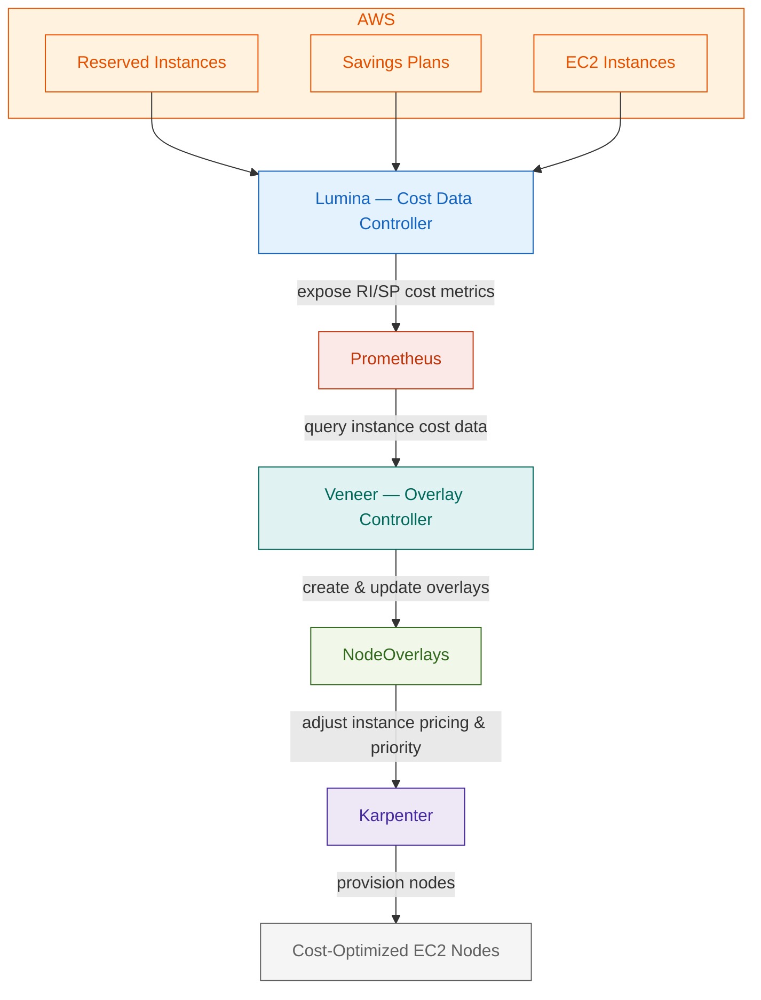

Veneer is a Kubernetes controller that optimizes [Karpenter](https://karpenter.sh/) provisioning decisions by managing NodeOverlay resources based on real-time AWS Reserved Instance and Savings Plans data from [Lumina](https://github.com/Nextdoor/lumina).

## How It Works

Veneer continuously watches Lumina's cost metrics and creates/updates/deletes Karpenter **NodeOverlay** CRs to prefer RI/SP-covered on-demand instances when cost-effective, fall back to spot when capacity is exhausted, avoid provisioning thrashing with smart debouncing, and express instance preferences via NodePool annotations.

Use the section navigation below to explore the documentation.
