## Overview

Veneer is a Kubernetes controller that bridges the gap between AWS cost data and Karpenter provisioning decisions. It continuously monitors Savings Plans and Reserved Instance utilization via [Lumina](https://github.com/Nextdoor/lumina) metrics in Prometheus, then manages [NodeOverlay]() custom resources to steer Karpenter toward cost-optimal instance types.

## Data Flow

1. **Lumina** discovers AWS Savings Plans, Reserved Instances, and running EC2 instances. It computes utilization and remaining capacity, then exposes these as Prometheus metrics.
2. **Veneer** queries Prometheus on a 5-minute interval (matching Lumina's refresh cycle). The decision engine analyzes capacity data and determines which NodeOverlays should exist.
3. **Karpenter** reads NodeOverlay resources and applies price adjustments to its instance type offerings. Adjusted prices become Priority values in the AWS CreateFleet API call.
4. **AWS** selects instances based on the allocation strategy and Priority values. See [Instance Selection Deep Dive]() for details.

## Two Reconcilers

Veneer runs two independent reconciliation loops:

### Metrics Reconciler

The metrics reconciler runs on a timed interval (every 5 minutes) and is responsible for cost-aware overlay management:

```mermaid
flowchart TD
    Start["Timer fires (every 5 min)"]
    Fresh{"Data fresh?"}
    Query["Query Prometheus for\nSP utilization, SP capacity,\nRI counts"]
    Decide{"For each SP/RI:\nutilization < threshold\nand capacity available?"}
    Create["Create or update\nNodeOverlay"]
    Delete["Delete NodeOverlay\n(if exists)"]
    Skip["Skip reconciliation\n(preserve last state)"]
    Done["Reconciliation complete"]

    Start --> Fresh
    Fresh -->|"Yes"| Query
    Fresh -->|"No — stale data"| Skip
    Query --> Decide
    Decide -->|"Yes"| Create
    Decide -->|"No"| Delete
    Create --> Done
    Delete --> Done
    Skip --> Done

    style Start fill:#e3f2fd,stroke:#1565c0,color:#1565c0
    style Fresh fill:#fff3e0,stroke:#e65100,color:#e65100
    style Query fill:#e0f2f1,stroke:#00695c,color:#00695c
    style Decide fill:#fff3e0,stroke:#e65100,color:#e65100
    style Create fill:#f1f8e9,stroke:#33691e,color:#33691e
    style Delete fill:#fbe9e7,stroke:#bf360c,color:#bf360c
    style Skip fill:#f5f5f5,stroke:#616161,color:#616161
    style Done fill:#ede7f6,stroke:#4527a0,color:#4527a0
```

1. **Query Prometheus** for Lumina metrics:
   - Savings Plan utilization percentages
   - Savings Plan remaining capacity ($/hour)
   - Reserved Instance counts by type and region
2. **Check data freshness** -- Skip reconciliation if Lumina data is stale
3. **Run the decision engine** -- For each SP and RI, determine whether a NodeOverlay should exist:
   - **Create overlay** when utilization is below the threshold (default 95%) and remaining capacity exists
   - **Delete overlay** when utilization exceeds the threshold or no capacity remains
4. **Apply changes** -- Create, update, or delete NodeOverlays in the cluster

### NodePool Reconciler

The NodePool reconciler watches for changes to Karpenter NodePool resources and manages preference-based overlays:

1. **Watch NodePools** for `veneer.io/preference.N` annotations
2. **Parse preference annotations** into matcher expressions and price adjustments
3. **Generate NodeOverlays** for each preference
4. **Clean up** overlays when preferences are removed or NodePools are deleted

See [Instance Preferences]() for annotation syntax and examples.

## Overlay Lifecycle

### Cost-Aware Overlays (from Lumina data)

Cost-aware overlays follow this lifecycle:

| Event | Action | Overlay State |
|-------|--------|---------------|
| SP utilization below threshold, capacity available | Create overlay | Active -- influences Karpenter pricing |
| SP utilization rises above threshold | Delete overlay | Removed -- Karpenter uses default pricing |
| RI count > 0 for instance type in region | Create overlay | Active |
| RI count drops to 0 | Delete overlay | Removed |
| Lumina data becomes stale | Skip reconciliation | No change -- last known state preserved |

### Preference Overlays (from NodePool annotations)

Preference overlays follow the NodePool lifecycle:

| Event | Action |
|-------|--------|
| Preference annotation added to NodePool | Create overlay |
| Preference annotation value changed | Update overlay |
| Preference annotation removed | Delete overlay |
| NodePool deleted | Overlay garbage collected via owner reference |

### Weight Hierarchy

When multiple overlays target the same instance types, the overlay with the highest weight wins:

| Overlay Type | Default Weight | Scope |
|-------------|----------------|-------|
| Reserved Instance | 30 | Instance-type specific (e.g., `m5.xlarge` in `us-west-2`) |
| EC2 Instance Savings Plan | 20 | Family-specific (e.g., `m5` family in `us-west-2`) |
| Compute Savings Plan | 10 | Global (all families, all regions) |
| Preference | 1-9 (from annotation) | User-defined scope |

Keep preference overlay weights below 10 to ensure cost-aware overlays (backed by real AWS capacity data) take precedence.

## Disabled Mode

Veneer supports a "disabled" mode (`overlays.disabled: true`) that creates NodeOverlays with an impossible requirement (`veneer.io/disabled: true`). This allows testing overlay creation logic without affecting Karpenter's provisioning decisions. The `veneer_config_overlays_disabled` metric reports this state.
