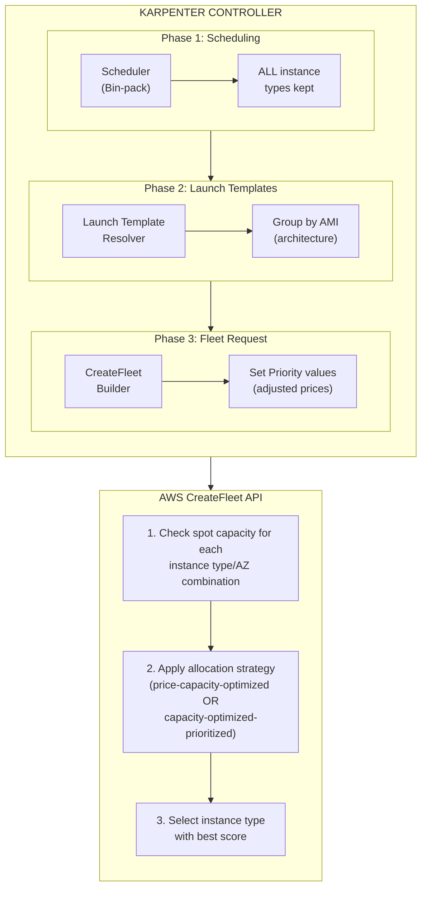
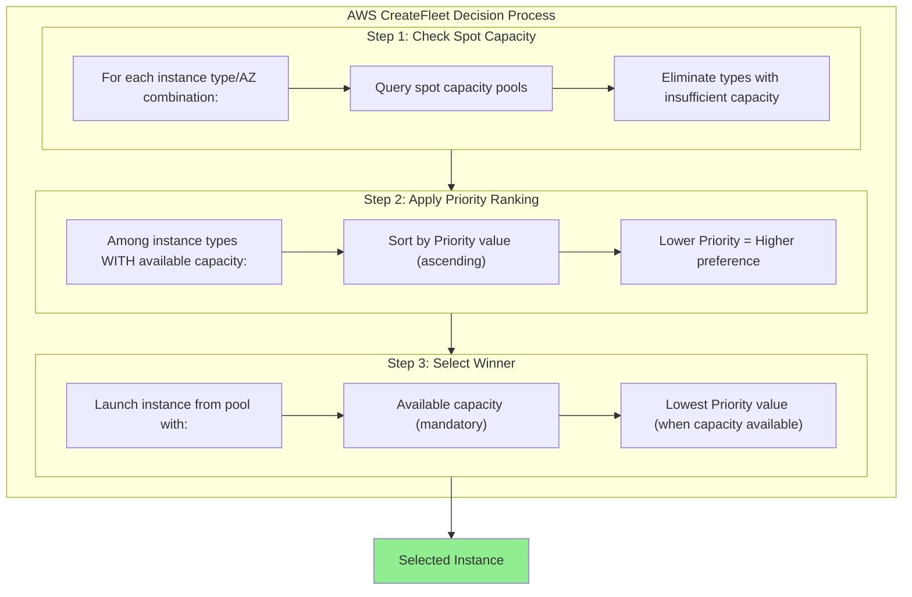

This document provides a detailed technical explanation of how Karpenter selects EC2 instances, from pod scheduling through the AWS CreateFleet API call. Understanding this flow is essential for configuring Veneer's NodeOverlay feature to influence instance selection.

## Overview

Karpenter does **not** make the final instance type selection. Instead, it:

1. **Filters** instance types based on NodePool requirements and pod constraints
2. **Sorts** instance types by adjusted price
3. **Truncates** to a maximum of 60 instance types
4. **Delegates** the final selection to AWS via the CreateFleet API

AWS CreateFleet makes the ultimate decision based on:
- Spot capacity availability
- Allocation strategy
- Priority values (when using `capacity-optimized-prioritized`)

## Architecture Flow



## Phase 1: Scheduling and Bin-Packing

### Code Location
- **Repository**: [kubernetes-sigs/karpenter](https://github.com/kubernetes-sigs/karpenter)
- **File**: [`pkg/controllers/provisioning/scheduling/scheduler.go`](https://github.com/kubernetes-sigs/karpenter/blob/v1.8.2/pkg/controllers/provisioning/scheduling/scheduler.go#L103-L150)

### What Happens

The scheduler performs bin-packing simulation to determine which pods can fit on potential nodes. Critically, it does **not** select a specific instance type or architecture at this stage.

> **Source**: [`scheduler.go#L103-L150`](https://github.com/kubernetes-sigs/karpenter/blob/v1.8.2/pkg/controllers/provisioning/scheduling/scheduler.go#L103-L150)

```go
// The scheduler keeps ALL compatible instance types - it does not pick ARM vs x86 here
func (s *Scheduler) Solve(ctx context.Context, pods []*corev1.Pod) Results {
    // ... bin-packing logic ...
    // Each NodeClaim contains ALL instance types that could satisfy the requirements
}
```

### Key Points

1. **No architecture decision**: The scheduler doesn't choose between ARM64 and x86
2. **All compatible types kept**: If 100 instance types match requirements, all 100 are passed forward
3. **Filtering only**: NodePool requirements filter out incompatible types, but don't select specific ones

## Phase 2: Launch Template Generation

### Code Location
- **Repository**: [aws/karpenter-provider-aws](https://github.com/aws/karpenter-provider-aws)
- **File**: [`pkg/providers/amifamily/resolver.go`](https://github.com/aws/karpenter-provider-aws/blob/v1.8.6/pkg/providers/amifamily/resolver.go#L145-L196)

### AMI-Based Grouping

Since AMIs are architecture-specific (ARM64 vs x86), Karpenter creates **separate launch template configurations** for each AMI:

> **Source**: [`resolver.go#L145-L196`](https://github.com/aws/karpenter-provider-aws/blob/v1.8.6/pkg/providers/amifamily/resolver.go#L145-L196)

```go
func (r DefaultResolver) Resolve(nodeClass *v1.EC2NodeClass, nodeClaim *karpv1.NodeClaim,
    instanceTypes []*cloudprovider.InstanceType, capacityType string, ...) ([]*LaunchTemplate, error) {

    // Map AMIs to compatible instance types
    mappedAMIs := MapToInstanceTypes(instanceTypes, nodeClass.Status.AMIs)

    var resolvedTemplates []*LaunchTemplate
    for amiID, instanceTypes := range mappedAMIs {
        // Each AMI (architecture) gets its own launch template config
        // ARM64 instances -> ARM64 AMI launch template
        // x86 instances -> x86 AMI launch template
    }
    return resolvedTemplates, nil
}
```

### MapToInstanceTypes Function

> **Source**: [`ami.go#L228-L241`](https://github.com/aws/karpenter-provider-aws/blob/v1.8.6/pkg/providers/amifamily/ami.go#L228-L241)

```go
func MapToInstanceTypes(instanceTypes []*cloudprovider.InstanceType, amis []v1.AMI) map[string][]*cloudprovider.InstanceType {
    amiIDs := map[string][]*cloudprovider.InstanceType{}
    for _, instanceType := range instanceTypes {
        for _, ami := range amis {
            if err := instanceType.Requirements.Compatible(
                scheduling.NewNodeSelectorRequirements(ami.Requirements...),
            ); err == nil {
                amiIDs[ami.ID] = append(amiIDs[ami.ID], instanceType)
                break
            }
        }
    }
    return amiIDs
}
```

## Phase 3: CreateFleet API Call

### Code Location
- **Repository**: [aws/karpenter-provider-aws](https://github.com/aws/karpenter-provider-aws)
- **File**: [`pkg/providers/instance/instance.go`](https://github.com/aws/karpenter-provider-aws/blob/v1.8.6/pkg/providers/instance/instance.go#L63)

### Instance Type Limit

Karpenter enforces a maximum of **60 instance types** per CreateFleet request:

> **Source**: [`instance.go#L63`](https://github.com/aws/karpenter-provider-aws/blob/v1.8.6/pkg/providers/instance/instance.go#L63)

```go
const maxInstanceTypes = 60
```

### Sorting and Truncation

Before sending to AWS, instance types are sorted by price and truncated:

> **Source**: [`types.go#L221-L233`](https://github.com/kubernetes-sigs/karpenter/blob/v1.8.2/pkg/cloudprovider/types.go#L221-L233)

```go
func (its InstanceTypes) OrderByPrice(reqs scheduling.Requirements) InstanceTypes {
    sort.Slice(its, func(i, j int) bool {
        iPrice := its[i].Offerings.Available().CompatibleFor(reqs).LowestPrice()
        jPrice := its[j].Offerings.Available().CompatibleFor(reqs).LowestPrice()
        if iPrice != jPrice {
            return iPrice < jPrice
        }
        return its[i].Name < its[j].Name
    })
    return its
}
```

> **Source**: [`types.go#L322-L327`](https://github.com/kubernetes-sigs/karpenter/blob/v1.8.2/pkg/cloudprovider/types.go#L322-L327)

```go
func (its InstanceTypes) Truncate(reqs scheduling.Requirements, maxItems int) InstanceTypes {
    its = its.OrderByPrice(reqs)
    if len(its) > maxItems {
        return its[:maxItems]
    }
    return its
}
```

### Building the CreateFleet Request

> **Source**: [`instance.go#L456-L486`](https://github.com/aws/karpenter-provider-aws/blob/v1.8.6/pkg/providers/instance/instance.go#L456-L486)

```go
func (p *DefaultProvider) getOverrides(
    instanceTypes []*cloudprovider.InstanceType,
    offerings cloudprovider.Offerings,
    zones, subnets *resourceSet,
    image string,
) []ec2types.FleetLaunchTemplateOverridesRequest {
    var overrides []ec2types.FleetLaunchTemplateOverridesRequest
    for _, offering := range offerings {
        // ... zone/subnet matching ...
        overrides = append(overrides, ec2types.FleetLaunchTemplateOverridesRequest{
            InstanceType:     ec2types.InstanceType(instanceType.Name),
            SubnetId:         aws.String(subnet),
            ImageId:          aws.String(image),
            AvailabilityZone: aws.String(offering.Requirements.Get(karpv1.TopologyLabelZone).Any()),
            // CRITICAL: Priority is set to the offering price
            Priority: lo.ToPtr(float64(offering.Price)),
        })
    }
    return overrides
}
```

## Allocation Strategies

### Code Location
- **Repository**: [aws/karpenter-provider-aws](https://github.com/aws/karpenter-provider-aws)
- **File**: [`pkg/providers/instance/types.go#L209-L240`](https://github.com/aws/karpenter-provider-aws/blob/v1.8.6/pkg/providers/instance/types.go#L209-L240)

### Strategy Selection Logic

> **Source**: [`types.go#L209-L240`](https://github.com/aws/karpenter-provider-aws/blob/v1.8.6/pkg/providers/instance/types.go#L209-L240)

```go
func (b *CreateFleetInputBuilder) Build() *ec2.CreateFleetInput {
    input := &ec2.CreateFleetInput{
        Type: ec2types.FleetTypeInstant,
        // ...
    }

    if b.capacityType == karpv1.CapacityTypeSpot {
        input.SpotOptions = &ec2types.SpotOptionsRequest{
            // WITH NodeOverlay (overlay=true): capacity-optimized-prioritized
            // WITHOUT NodeOverlay (overlay=false): price-capacity-optimized
            AllocationStrategy: lo.Ternary(
                b.overlay,
                ec2types.SpotAllocationStrategyCapacityOptimizedPrioritized,
                ec2types.SpotAllocationStrategyPriceCapacityOptimized,
            ),
        }
    } else if b.capacityReservationType != v1.CapacityReservationTypeCapacityBlock {
        input.OnDemandOptions = &ec2types.OnDemandOptionsRequest{
            // WITH NodeOverlay: prioritized
            // WITHOUT NodeOverlay: lowest-price
            AllocationStrategy: lo.Ternary(
                b.overlay,
                ec2types.FleetOnDemandAllocationStrategyPrioritized,
                ec2types.FleetOnDemandAllocationStrategyLowestPrice,
            ),
        }
    }
    return input
}
```

### Strategy Comparison

| Scenario | Spot Strategy | On-Demand Strategy |
|----------|--------------|-------------------|
| **Default (no NodeOverlay)** | `price-capacity-optimized` | `lowest-price` |
| **With NodeOverlay** | `capacity-optimized-prioritized` | `prioritized` |

### How Each Strategy Works

> **AWS Documentation Reference**: The [FleetLaunchTemplateOverridesRequest.Priority](https://docs.aws.amazon.com/AWSEC2/latest/APIReference/API_FleetLaunchTemplateOverridesRequest.html) documentation explicitly states when Priority is used:
>
> *"If the Spot `AllocationStrategy` is set to `capacity-optimized-prioritized`, EC2 Fleet uses priority on a best-effort basis to determine which launch template override to use in fulfilling Spot capacity, but optimizes for capacity first."*
>
> *"If the On-Demand `AllocationStrategy` is set to `prioritized`, EC2 Fleet uses priority to determine which launch template override to use first in fulfilling On-Demand capacity."*
>
> This means Priority is **only used** with these two specific strategies.

#### `price-capacity-optimized` (Default for Spot)
- AWS balances price and capacity availability
- Automatically diversifies across pools to reduce interruptions
- **Does not use Priority values** -- the Priority field is ignored even if set

#### `capacity-optimized-prioritized` (With NodeOverlay)
- AWS first ensures capacity is available
- Among available pools, selects based on Priority (lower = better)
- **Uses Priority values** -- this is how Veneer influences selection

#### `lowest-price` (Default for On-Demand)
- Selects the cheapest instance type
- **Does not use Priority values** -- selection is purely price-based

#### `prioritized` (With NodeOverlay for On-Demand)
- Selects based on Priority (lower = better)
- **Uses Priority values**

## Priority Values and Price Adjustments

### How Veneer Adjustments Work

When a NodeOverlay specifies a price adjustment (e.g., `adjust=-50%`), Karpenter modifies the **offering price** before setting the Priority:

> **Source**: [`types.go#L369-L384`](https://github.com/kubernetes-sigs/karpenter/blob/v1.8.2/pkg/cloudprovider/types.go#L369-L384)

```go
func (o Offering) AdjustedPrice() float64 {
    // If no overlay, return base price
    if o.Overlay == nil || o.Overlay.Adjustment == nil {
        return o.Price
    }

    // Apply percentage adjustment
    if o.Overlay.Adjustment.Percentage != nil {
        return o.Price * (1 + *o.Overlay.Adjustment.Percentage/100)
    }

    // Apply absolute adjustment
    if o.Overlay.Adjustment.Absolute != nil {
        return o.Price + *o.Overlay.Adjustment.Absolute
    }

    return o.Price
}
```

### Example: ARM64 -50% Adjustment

Given base spot prices:
- `m8g.24xlarge` (ARM64): $1.27/hr
- `m7i.12xlarge` (x86): $0.78/hr

With `-50%` adjustment on ARM64:
- `m8g.24xlarge` adjusted: $1.27 * 0.5 = **$0.635/hr**
- `m7i.12xlarge` unchanged: **$0.78/hr**

Priority values sent to CreateFleet:
- `m8g.24xlarge`: Priority = 0.635 (lower = better)
- `m7i.12xlarge`: Priority = 0.78

## How AWS Makes the Final Selection

### With `capacity-optimized-prioritized`



### Why x86 Might Still Be Selected

Even with lower Priority values for ARM64, AWS may select x86 if:

1. **ARM64 spot pools are exhausted** -- No capacity available
2. **ARM64 has recent interruptions** -- AWS may deprioritize volatile pools
3. **AZ constraints** -- Required AZ only has x86 capacity

## Real-World Examples

### Example CreateFleet Request (with NodeOverlay)

```json
{
  "Type": "instant",
  "TargetCapacitySpecification": {
    "DefaultTargetCapacityType": "spot",
    "TotalTargetCapacity": 1
  },
  "SpotOptions": {
    "AllocationStrategy": "capacity-optimized-prioritized"
  },
  "LaunchTemplateConfigs": [
    {
      "LaunchTemplateSpecification": {
        "LaunchTemplateName": "karpenter.k8s.aws/13299866299363256344",
        "Version": "$Latest"
      },
      "Overrides": [
        {
          "InstanceType": "c6gn.16xlarge",
          "ImageId": "ami-06bd99f6c8a066836",
          "AvailabilityZone": "us-west-2b",
          "SubnetId": "subnet-0c7dc4bd1e242e84b",
          "Priority": 0.29118
        },
        {
          "InstanceType": "m8g.12xlarge",
          "ImageId": "ami-06bd99f6c8a066836",
          "AvailabilityZone": "us-west-2b",
          "SubnetId": "subnet-0c7dc4bd1e242e84b",
          "Priority": 0.49020
        },
        {
          "InstanceType": "m8g.24xlarge",
          "ImageId": "ami-06bd99f6c8a066836",
          "AvailabilityZone": "us-west-2b",
          "SubnetId": "subnet-0c7dc4bd1e242e84b",
          "Priority": 0.63342
        }
      ]
    },
    {
      "LaunchTemplateSpecification": {
        "LaunchTemplateName": "karpenter.k8s.aws/2908816957350676553",
        "Version": "$Latest"
      },
      "Overrides": [
        {
          "InstanceType": "m7i.12xlarge",
          "ImageId": "ami-0894e3f68fa1384c4",
          "AvailabilityZone": "us-west-2b",
          "SubnetId": "subnet-0c7dc4bd1e242e84b",
          "Priority": 0.7807
        },
        {
          "InstanceType": "m6i.12xlarge",
          "ImageId": "ami-0894e3f68fa1384c4",
          "AvailabilityZone": "us-west-2b",
          "SubnetId": "subnet-0c7dc4bd1e242e84b",
          "Priority": 0.8202
        }
      ]
    }
  ]
}
```

**Key observations:**
- Two launch template configs: one for ARM64 AMI, one for x86 AMI
- ARM64 instances have lower Priority values (0.29 - 0.63) due to -50% adjustment
- x86 instances have higher Priority values (0.78 - 0.82)

### Example CreateFleet Response

```json
{
  "fleetId": "fleet-989ca286-f32f-ce94-043a-05a885465b32",
  "fleetInstanceSet": {
    "item": {
      "lifecycle": "spot",
      "instanceType": "m8g.24xlarge",
      "instanceIds": {
        "item": "i-0708bc0ab5c887271"
      },
      "launchTemplateAndOverrides": {
        "overrides": {
          "instanceType": "m8g.24xlarge",
          "imageId": "ami-06bd99f6c8a066836",
          "availabilityZone": "us-west-2b",
          "priority": 0.63342
        }
      }
    }
  }
}
```

**Result:** AWS selected `m8g.24xlarge` (ARM64) because:
1. Spot capacity was available for this instance type
2. It had a lower Priority than x86 alternatives (0.63 vs 0.78+)

### Example: When x86 Gets Selected Despite Lower ARM64 Priority

```json
{
  "fleetInstanceSet": {
    "item": {
      "lifecycle": "spot",
      "instanceType": "m7a.32xlarge",
      "launchTemplateAndOverrides": {
        "overrides": {
          "instanceType": "m7a.32xlarge",
          "priority": 0.95
        }
      }
    }
  },
  "errorSet": {
    "item": [
      {
        "errorCode": "InsufficientInstanceCapacity",
        "errorMessage": "We currently do not have sufficient m8g.24xlarge capacity...",
        "launchTemplateAndOverrides": {
          "overrides": {
            "instanceType": "m8g.24xlarge",
            "priority": 0.63
          }
        }
      }
    ]
  }
}
```

This response shows that even though `m8g.24xlarge` had a better Priority (0.63), AWS selected `m7a.32xlarge` (0.95) because the ARM64 pool had insufficient capacity.

## Implications for Veneer NodeOverlay

### How NodeOverlay Influences Selection

1. **Triggers `capacity-optimized-prioritized` strategy** -- Without NodeOverlay, Karpenter uses `price-capacity-optimized` which ignores Priority values entirely

2. **Sets Priority values** -- The adjusted prices become Priority values in the CreateFleet request

3. **Does NOT guarantee selection** -- AWS capacity availability takes precedence

### Effective Configuration

```yaml
apiVersion: karpenter.sh/v1
kind: NodePool
metadata:
  name: my-nodepool
  annotations:
    # Veneer annotation to prefer ARM64 with -50% price adjustment
    veneer.io/preference.1: "kubernetes.io/arch=arm64 adjust=-50%"
spec:
  template:
    spec:
      requirements:
        # Allow both architectures
        - key: kubernetes.io/arch
          operator: In
          values: ["amd64", "arm64"]
```

### What This Achieves

| Without NodeOverlay | With NodeOverlay (-50% ARM64) |
|---------------------|-------------------------------|
| Strategy: `price-capacity-optimized` | Strategy: `capacity-optimized-prioritized` |
| AWS balances price + capacity | AWS prioritizes capacity, then Priority |
| Priority values ignored | Priority values used for selection |
| ~50/50 ARM64/x86 selection | ARM64 preferred when capacity available |

## Code References

| Component | Repository | File | Line |
|-----------|------------|------|------|
| Max instance types | [karpenter-provider-aws](https://github.com/aws/karpenter-provider-aws) | [`pkg/providers/instance/instance.go`](https://github.com/aws/karpenter-provider-aws/blob/v1.8.6/pkg/providers/instance/instance.go#L63) | 63 |
| Priority assignment | [karpenter-provider-aws](https://github.com/aws/karpenter-provider-aws) | [`pkg/providers/instance/instance.go`](https://github.com/aws/karpenter-provider-aws/blob/v1.8.6/pkg/providers/instance/instance.go#L476) | 476 |
| Allocation strategy | [karpenter-provider-aws](https://github.com/aws/karpenter-provider-aws) | [`pkg/providers/instance/types.go`](https://github.com/aws/karpenter-provider-aws/blob/v1.8.6/pkg/providers/instance/types.go#L209-L217) | 209-217 |
| Price adjustment | [karpenter](https://github.com/kubernetes-sigs/karpenter) | [`pkg/cloudprovider/types.go`](https://github.com/kubernetes-sigs/karpenter/blob/v1.8.2/pkg/cloudprovider/types.go#L369-L384) | 369-384 |
| Instance type sorting | [karpenter](https://github.com/kubernetes-sigs/karpenter) | [`pkg/cloudprovider/types.go`](https://github.com/kubernetes-sigs/karpenter/blob/v1.8.2/pkg/cloudprovider/types.go#L221-L233) | 221-233 |
| Instance type truncation | [karpenter](https://github.com/kubernetes-sigs/karpenter) | [`pkg/cloudprovider/types.go`](https://github.com/kubernetes-sigs/karpenter/blob/v1.8.2/pkg/cloudprovider/types.go#L322-L327) | 322-327 |
| AMI to instance mapping | [karpenter-provider-aws](https://github.com/aws/karpenter-provider-aws) | [`pkg/providers/amifamily/ami.go`](https://github.com/aws/karpenter-provider-aws/blob/v1.8.6/pkg/providers/amifamily/ami.go#L228-L241) | 228-241 |
| Launch template resolution | [karpenter-provider-aws](https://github.com/aws/karpenter-provider-aws) | [`pkg/providers/amifamily/resolver.go`](https://github.com/aws/karpenter-provider-aws/blob/v1.8.6/pkg/providers/amifamily/resolver.go#L135-L197) | 135-197 |

## Summary

1. **Karpenter doesn't select the instance** -- It filters, sorts, and sends options to AWS
2. **NodeOverlay enables Priority-based selection** -- Changes allocation strategy from `price-capacity-optimized` to `capacity-optimized-prioritized`
3. **Priority = Adjusted Price** -- Lower values = higher preference
4. **Capacity trumps Priority** -- AWS will select a higher-Priority (worse) instance if the lower-Priority option lacks capacity
5. **Architecture is grouped by AMI** -- ARM64 and x86 instances use different launch templates but are sent in the same CreateFleet request
6. **Maximum 60 instance types** -- Karpenter truncates the list after sorting by price
